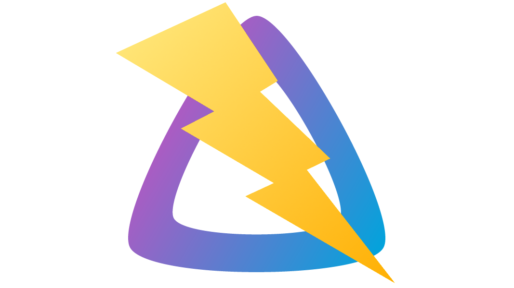
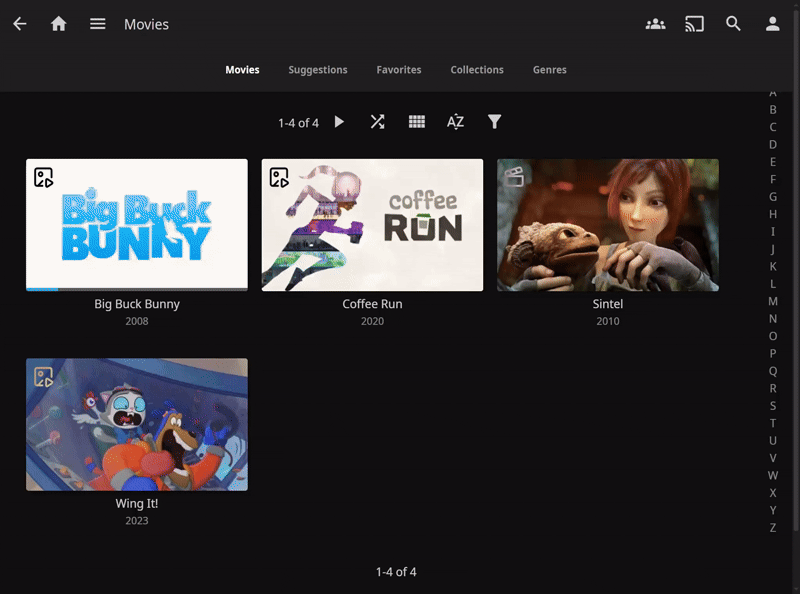
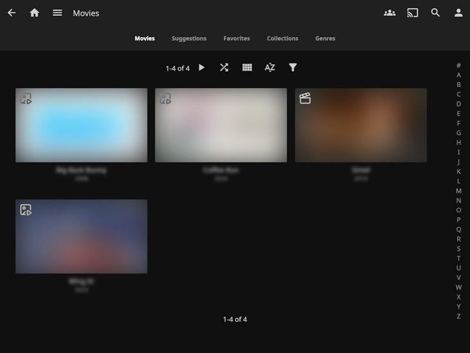

  

# Jellyfin Powertoys

A collection of plugins to enhance Jellyfin media server with additional features and tools.

## Installation

1. Go to the Jellyfin Administration Dashboard
2. Navigate to **Plugins** > **Catalog**
3. Add the catalog URL: `https://raw.githubusercontent.com/lennykean/jellyfin-powertoys/main/manifest.json`
4. Install the desired plugins
5. Restart the Jellyfin server

## Plugins

### Thumbnail Previews

**Adds thumbnail previews using trickplay images or trailers.**

- **Slideshow Preview** - Cycles through trickplay images as an animated slideshow.
- **Trailer Preview** - Plays a video trailer directly on the thumbnail.
  - Uses local or remote trailers if available
- **Hover Play** - Triggers previews or automatically on mouse hover

---

---

### Remote Trailers
**Enables playback of remote trailers from any source.**

- Play trailers from any remote source (not just YouTube)
- Basic HTML video player

### Cast Curator
**Automatically organize your library by cast and crew members.**

- Creates collections based on actors, directors, writers, and other crew members
- Flexible filtering options allow customization and selection of which cast or crew to include

### Studio Curator
**Automatically organize your library by studio.**

- Creates collections based on production studios
- Flexible filtering options allow customization and selection of which studios to include

### Watch History Janitor
**Cleans up the "Continue Watching" history after a specified time period.**

- Automatic cleanup of "Continue Watching" section
- Customizable options control how long to keep history, and which users to target.
### Privacy Mode

**Adds a privacy mode that hides content when activated.**

- Adds a privacy blur to the Jellyfin interface
- Optional reveal on hover
- Toggle via hotkeys

---

